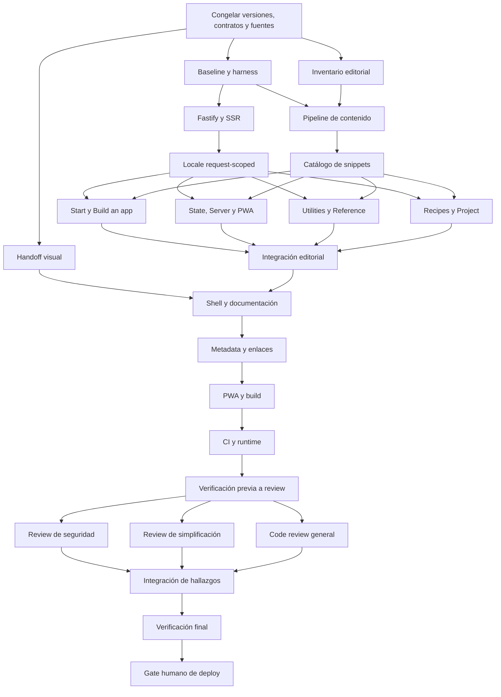

# Plan de implementación del sitio de Valyrian.js

> **Para agentes ejecutores:** usa `subagent-driven-development` para ejecutar este plan por waves. Usa `executing-plans` cuando una tarea comparta archivos o requiera secuencia estricta. Esta fase solo define el plan. No implementa el sitio ni autoriza un deploy.

**Objetivo:** reconstruir el sitio oficial para presentar Valyrian.js actual, publicar toda su documentación vigente en inglés y español, y llevar a una persona nueva desde la evaluación hasta una primera aplicación funcional.

**Arquitectura:** el sitio conservará SSR con Valyrian.js actual y un servidor Fastify sencillo. Fastify escuchará en el puerto local `3023` y respetará `PORT` cuando el entorno de despliegue lo proporcione. El contenido tendrá un registro versionado, dos variantes editoriales completas y una sola estructura de rutas sin prefijos de idioma. Dragonglass será la solución CSS interna y nunca aparecerá como documentación pública.

**Stack objetivo:** JavaScript sobre una versión LTS de Node compatible con la versión vigente de Valyrian.js, Fastify, la versión vigente de Dragonglass, SSR, PWA completa, pruebas HTTP con la inyección de Fastify, pruebas con `node:test` y pruebas de navegador para hidratación, accesibilidad y PWA. Las referencias recibidas corresponden a Valyrian.js `9.1.13` y Dragonglass `2.0.1`, pero T0 debe revalidar sus contratos antes de fijar el stack ejecutable.

---

## 1. Alcance confirmado

### Incluido

- Actualizar Valyrian.js desde `5.0.8` hasta la versión vigente verificada al iniciar la ejecución. La referencia recibida corresponde a `9.1.13`.
- Migrar los contratos antiguos basados en `valyrian.js/register`, plugins globales y `v.*` hacia los módulos públicos actuales de Valyrian.js.
- Sustituir Micro y `micro-ex-router` por Fastify con una integración directa y sin capas innecesarias.
- Conservar SSR y garantizar aislamiento por solicitud.
- Servir localmente en el puerto `3023`. En un entorno administrado, `PORT` tiene precedencia para que el proveedor pueda iniciar el proceso.
- Crear una PWA completa con instalación, manifest, service worker, caché segura, navegación offline y experiencia localizada.
- Publicar toda la documentación vigente de Valyrian.js en inglés y español.
- Crear una arquitectura de información, un diseño y un copy nuevos con enfoque en adopción.
- Mantener una sola estructura de rutas, sin `/en`, `/es` ni otro prefijo de idioma.
- Conservar el logotipo y usar `#6a59b8` como color de marca.
- Actualizar Dragonglass a su versión vigente verificada al iniciar la ejecución. La referencia recibida corresponde a `2.0.1`.
- Incorporar búsqueda local por idioma sobre títulos, headings, APIs y términos.
- Cumplir WCAG 2.2 AA en navegación, lectura, interacción, color y foco.
- Actualizar build, pruebas, CI, configuración de runtime y documentación operativa.

### Excluido

- Publicar documentación, guías o ejemplos de Dragonglass.
- Conservar por obligación la estructura o las URLs actuales.
- Crear redirecciones de URLs antiguas sin evidencia de que tengan valor operativo.
- Presentar el meta-framework o la CLI planificada como funcionalidad disponible.
- Introducir TypeScript como parte de esta migración. El repositorio actual es JavaScript y el cambio no lo necesita.
- Agregar CMS, backend editorial, base de datos, autenticación, analítica o búsqueda remota.
- Ejecutar un deploy durante la implementación sin una autorización posterior y explícita.
- Promover versiones o detener versiones anteriores desde un script local automático.

## 2. Fuentes de verdad

- Documentación pública de Valyrian.js: <https://github.com/Masquerade-Circus/valyrian.js/blob/main/llms-full.txt>
- Referencia técnica interna para actualizar Dragonglass: <https://github.com/Masquerade-Circus/dragonglass/blob/master/docs/llms-full.txt>
- Repositorio del sitio y sus contratos existentes.

La fuente de Valyrian.js manda sobre firmas, nombres, módulos, requisitos, restricciones, advertencias, disponibilidad y ejemplos normativos. El equipo puede reescribir la estructura, los títulos, las introducciones, el orden, las transiciones y los ejemplos editoriales, pero debe preservar el contrato técnico. Dragonglass solo informa la implementación visual.

## 3. Hallazgos que condicionan la ejecución

- El sitio actual usa Valyrian.js `5.0.8`, Dragonglass `1.0.2`, Micro y APIs globales retiradas.
- La actualización cruza cuatro versiones mayores y requiere migrar servidor, router, SSR, cliente, build, service worker y ejemplos.
- El repositorio declara Node `>=11` y App Engine `nodejs12`, mientras Valyrian.js actual requiere Node 18 o superior.
- Las páginas API y Examples actuales están vacías. La documentación local representa el modelo antiguo.
- La fuente vigente contiene 43 documentos sobre runtime, routing, datos, asincronía, formularios, estado, SSR, Node, PWA, traducción, utilidades, integraciones, producción, proyecto y contribución.
- El sitio actual no tiene bilingüismo, pruebas, CI ni aislamiento demostrado del idioma durante SSR.
- El service worker actual precachea solo `/`, conserva un nombre de caché antiguo y puede borrar cachés ajenos.
- Dragonglass 2 separa CSS base y tema. El markup actual depende de contratos de la versión anterior.
- `build.js` usa contratos antiguos y `svgo.js` depende de `recursive-readdir` sin declararlo directamente.
- `PLAN.md` ya existe y debe conservarse como el documento rector de la migración.

## 4. Decisiones integradas

### 4.1 Servidor y SSR

- Fastify será el único servidor HTTP.
- La integración será directa. No se crearán adapters, factories ni capas de servicio que solo reenvíen llamadas.
- El servidor usará `3023` como puerto predeterminado y `PORT` como override del entorno.
- Cada solicitud SSR se ejecutará dentro de `ServerStorage.run` o del mecanismo request-scoped vigente confirmado en Valyrian.js.
- El router resolverá la URL en el servidor mediante los contratos públicos actuales antes de renderizar.
- El servidor y el cliente producirán el mismo árbol para evitar divergencias de hidratación.
- Fastify responderá con 404, errores y headers explícitos. Las respuestas de error no expondrán stacks, rutas internas ni datos de configuración.
- CORS quedará desactivado porque el sitio no necesita una API pública cross-origin. Solo se agregará si aparece un caller real.
- Los assets tendrán caché pública con hash. El HTML tendrá inglés fijo y no se almacenará en cachés compartidas.

### 4.2 Idioma sin prefijo

- Todas las páginas usarán el mismo pathname en ambos idiomas.
- El selector de idioma guardará `en` o `es` en `localStorage` mediante la estrategia de almacenamiento de `valyrian.js/translate` y actualizará el estado del cliente sin recargar la página.
- El servidor renderizará siempre en inglés. El estado SSR y la hidratación inicial usarán `locale: "en"`.
- El cliente validará el valor persistido antes de usarlo y recurrirá a inglés cuando falte o sea inválido. Un valor inválido nunca se convertirá en nombre de archivo, clave de caché ni entrada de HTML.
- Cada respuesta HTML incluirá `Content-Language: en`, `<html lang="en">`, metadata, navegación, 404 y mensajes en inglés. El cliente actualizará el árbol y `<html lang>` después de restaurar otro idioma válido.
- El HTML usará una política privada o sin almacenamiento compartido y no variará por idioma.
- Los assets, índices de búsqueda y artefactos PWA podrán usar rutas internas localizadas o claves de caché con locale. Esta separación no crea prefijos en las URLs públicas de documentación.
- El selector conservará la página actual porque los dos idiomas comparten pathname.
- El sitio no publicará `hreflang` con URLs falsas. Podrá declarar una canonical única y `Content-Language` mientras la decisión de URL sin prefijo siga vigente.
- El plan acepta una consecuencia de la decisión del usuario: los buscadores no tendrán una URL independiente para cada traducción. La prioridad será una experiencia bilingüe coherente en una sola ruta.

### 4.3 Aislamiento de traducción

- Antes de migrar contenido se escribirá una prueba concurrente que renderice solicitudes inglesas y españolas intercaladas.
- Si `setLang` queda aislado dentro de `ServerStorage.run`, se usará el módulo actual de traducción para UI y contratos cortos.
- Si `setLang` conserva estado global entre solicitudes, SSR no dependerá de ese estado. El idioma viajará en el contexto request-scoped y el renderer recibirá explícitamente el contenido localizado.
- Los textos de interfaz vivirán en diccionarios pequeños mediante las capacidades de traducción actuales.
- Los capítulos largos vivirán como contenido localizado por documento. No se crearán diccionarios gigantes.

### 4.4 Modelo editorial

- Un registro central describirá los 43 documentos fuente con ID estable, URL fuente, sección, tipo editorial, pathname, orden, estado, versión revisada, fecha de revisión, variante inglesa, variante española, ejemplos y ownership.
- Cada fuente deberá mapearse a una página, sección o hub. Ninguna podrá desaparecer sin una justificación registrada.
- El inglés será la base técnica. El español será una traducción editorial completa con paridad de contratos, advertencias, ejemplos y enlaces.
- Los nombres de APIs, imports, módulos, propiedades y código no se traducirán.
- Los snippets compartidos tendrán una sola fuente y se insertarán en ambas variantes para evitar divergencia.
- El build fallará si un registro carece de fuente, pathname, inglés, español, estado o versión revisada.
- El meta-framework y la CLI se etiquetarán como planificados. El copy distinguirá con claridad lo disponible, lo experimental y lo futuro.
- La voz será activa y directa. El copy describirá acciones, resultados y límites verificables sin frases defensivas, dubitativas, miedosas ni claims de superioridad no demostrados.

### 4.5 Arquitectura de información

La navegación global usará estos destinos:

1. `Start`
2. `Guides`
3. `Reference`
4. `Recipes`
5. `GitHub`
6. Selector `EN` y `ES`

La estructura pública propuesta será:

- `/`: propuesta de valor, ejemplo inicial, continuidad navegador-servidor, ruta de adopción, capacidades, integraciones y CTA final.
- `/start`: introducción, instalación, primer componente y fundamentos.
- `/guides`: hub de guías.
- `/guides/build-an-app`: SPA, rutas, datos, requests, Suspense, Tasks, Query, Network, Offline y formularios.
- `/guides/state-and-performance`: estado avanzado, Pulses, FluxStore, Redux DevTools y optimización.
- `/guides/server-and-pwa`: runtime de navegador y servidor, SSR, hidratación, Node, networking, storage, PWA, service worker y server context.
- `/guides/utilities`: ecosistema, i18n, money, persistencia nativa y helpers.
- `/reference`: índice transversal y contratos canónicos del Runtime Core y módulos públicos.
- `/recipes`: Vite, Webpack o Rspack, Fastify, Express como integración documentada de Valyrian.js, API client, offline y producción.
- `/project`: estado del proyecto, trabajo planificado y contribución.

El registro de contenido definirá los pathnames finales de cada capítulo dentro de estos grupos. Los dos idiomas compartirán exactamente los mismos pathnames.

### 4.6 Página documental y búsqueda

- Cada página documental tendrá header, sidebar, artículo, tabla de contenido y navegación anterior/siguiente.
- En móvil, la sidebar será un panel controlable por teclado y la tabla de contenido permanecerá cerca del artículo.
- Cada capítulo incluirá título, resumen, prerrequisitos cuando apliquen, ejemplo, contrato, errores o límites documentados y siguiente paso.
- La búsqueda se generará en build como dos índices estáticos, uno por idioma.
- El índice cubrirá títulos, headings, APIs y términos. El buscador presentará estados de reposo, resultados, vacío y error.
- SSR no dependerá de la búsqueda. Una falla del índice no impedirá leer ni navegar la documentación.
- La búsqueda no traducirá nombres de API y devolverá enlaces bajo el idioma activo.

### 4.7 Diseño y Dragonglass

- El sitio conservará el logotipo y `#6a59b8` como token de marca.
- El diseño será técnico, sobrio y editorial. El código será material principal.
- El violeta se reservará para acciones, selección, enlaces y foco. Los estados no dependerán solo del color.
- Dragonglass cargará su CSS base y un tema compatible. Primero se validará el tema Violet de la versión vigente. Si no reproduce `#6a59b8` con contraste AA, se compilará un tema interno con ese token.
- El layout usará bordes, espacio y jerarquía antes que sombras o tarjetas decorativas.
- Las cards solo agruparán contenido con una relación real.
- El modo oscuro seguirá la capacidad nativa del tema y `prefers-color-scheme`. Un selector manual queda fuera de alcance porque el usuario no lo pidió.
- Dragonglass permanecerá invisible como tema editorial. El sitio no incluirá rutas, navegación ni resultados de búsqueda sobre Dragonglass.

### 4.8 PWA completa

- El manifest describirá el sitio, sus iconos, colores, modo de presentación y punto de inicio.
- El service worker usará un namespace exclusivo y una versión derivada del build.
- La activación eliminará únicamente cachés del namespace del sitio.
- Las solicitudes que no sean GET nunca entrarán a caché.
- Los assets con hash usarán cache-first.
- Las navegaciones usarán network-first con fallback offline.
- El service worker mantendrá entradas separadas por idioma aunque las páginas compartan pathname.
- El cliente comunicará el idioma activo al service worker. El fallback offline tendrá variantes inglesas y españolas precacheadas.
- Un cambio de idioma actualizará la clave de navegación offline y no devolverá contenido del locale anterior.
- La actualización del service worker será explícita y no interrumpirá una sesión sin informar al cliente.
- La PWA deberá superar pruebas de instalación, manifest, control del service worker, actualización, offline, idioma y limpieza segura de caché.

### 4.9 Seguridad, accesibilidad y rendimiento

- El renderer escapará contenido no confiable y limitará HTML raw a contenido editorial controlado y revisado.
- Los datos serializados para hidratación no podrán cerrar el elemento script ni inyectar markup.
- Fastify aplicará headers de seguridad compatibles con SSR y assets. La política CSP evitará inline scripts nuevos salvo una justificación medida.
- Los errores de servidor mostrarán mensajes seguros y registrarán contexto sin secretos.
- El sitio tendrá skip link, landmarks, headings jerárquicos, `aria-current`, foco visible, navegación completa por teclado y targets táctiles adecuados.
- El menú móvil no atrapará foco y devolverá el foco al control que lo abrió.
- El contenido soportará zoom, reduced motion, contraste AA y copia de snippets mediante un control accesible.
- El logotipo tendrá nombre accesible y los iconos decorativos quedarán ocultos para tecnologías de asistencia.
- Los cálculos invariantes, regex, normalizaciones, lookups y asignaciones se moverán fuera de loops sensibles al volumen cuando sea seguro.
- La implementación preferirá `for` y `for...of` cuando ofrezcan control y costo más claros que `forEach`.
- No se crearán helpers de una línea salvo que exista un contrato externo o la misma lógica aparezca al menos tres veces.
- Dos apariciones locales no justifican una abstracción si la duplicación mantiene el contexto claro.

### 4.10 Código mínimo y revisión continua de simplificación

- Cada decisión de implementación elegirá el menor código que cumpla todos los criterios de aceptación, seguridad, accesibilidad, SSR, bilingüismo y PWA. Reducir código nunca permite relajar esos contratos.
- El implementador reutilizará primero APIs actuales de Valyrian.js, Fastify, Dragonglass, Node y estructuras existentes. Una dependencia, wrapper, adapter, helper, capa, archivo o opción nueva deberá eliminar más complejidad de la que agrega.
- No se construirá flexibilidad especulativa, compatibilidad con URLs antiguas, frameworks internos ni extensiones sin un requisito vigente.
- Se preferirá borrar código antiguo y reducir superficie antes que mantener dos caminos para la misma responsabilidad.
- Un incremento de implementación será el cambio coherente más pequeño que satisface una conducta verificable y pasa sus comprobaciones enfocadas. No se agruparán conductas independientes para posponer la revisión.
- Después de cada incremento, una instancia fresca de `mini-kapa8`, distinta del implementador cuando este también sea `mini-kapa8`, hará una revisión read-only con objetivo exclusivo de simplificación.
- Ningún incremento podrá integrarse, alimentar una tarea dependiente ni marcarse completo hasta cerrar esta revisión y verificar cualquier simplificación aceptada.
- La revisión buscará código, dependencias, archivos, capas, configuración, duplicación, cálculos, loops y estados que puedan eliminarse, reutilizarse, inlinearse o expresarse de forma directa.
- La revisión no propondrá recortar cobertura documental, traducciones, controles de seguridad, accesibilidad, aislamiento SSR, comportamiento offline, pruebas exigidas ni decisiones explícitas del usuario.
- Si el implementador aplica una simplificación, repetirá las comprobaciones enfocadas y la misma instancia revisora confirmará que el incremento conserva el contrato. Este cierre no requiere otra revisión nueva salvo que la corrección introduzca una conducta o estructura distinta.

### 4.11 Workspace contenido

- La raíz del workspace es `/home/masquerade-circus/NodeJs/Creaken/valyrian.js-site`. Todo archivo del proyecto que un agente inspeccione o modifique deberá vivir en esa raíz o uno de sus descendientes.
- Todo estado creado por el trabajo permanecerá dentro del workspace. Esto incluye escrituras, temporales, cachés nuevas, descargas, perfiles, configuración efímera, logs, snapshots, reportes, dependencias y artefactos generados.
- Queda excluido de este límite únicamente el estado interno que la infraestructura de OpenCode genere automáticamente fuera del workspace durante la operación de sus herramientas, como el almacenamiento automático de una salida truncada. Esta excepción solo aplica cuando ningún agente inspecciona, modifica ni usa ese estado como archivo, entrada, evidencia o artefacto del trabajo. No autoriza escrituras externas controlables, temporales del proyecto, cachés del toolchain, descargas, perfiles, configuración, logs, reportes, dependencias ni artefactos generados por las tareas.
- Los agentes y subagentes usarán la raíz o uno de sus descendientes como directorio de trabajo. Ningún handoff puede ampliar el conjunto de archivos del proyecto hacia rutas padre, repositorios hermanos o checkouts externos.
- Se permite ejecutar el toolchain inmutable del sistema, como Node, Bun, Yarn, Git, navegadores y CLIs ya instaladas. También se permite que esas herramientas lean su configuración preexistente y consulten servicios remotos, siempre que el trabajo no cree ni modifique estado local fuera del workspace. La única excepción es el estado interno automático de OpenCode definido en el punto anterior.
- Los agentes no inspeccionarán directamente archivos del sistema, credenciales, repositorios hermanos ni configuración externa como si fueran parte del proyecto. El uso opaco y read-only que haga una herramienta instalada de su configuración preexistente no amplía el alcance de inspección del agente.
- Los symlinks no podrán usarse para inspeccionar archivos del proyecto ni escribir artefactos fuera del workspace. Antes de crear o modificar una ruta calculada, el ejecutor confirmará que su destino real permanece dentro del proyecto.
- Todo artefacto temporal vivirá bajo `./tmp/`. Las fuentes remotas materializadas, cachés nuevas, descargas de navegador, configuración efímera, logs y reportes temporales usarán subdirectorios de `./tmp/` y se limpiarán desde la misma raíz cuando dejen de ser necesarios.
- Las dependencias se instalarán localmente en `node_modules/`. El package manager usará el lockfile del proyecto y tendrá sus escrituras de caché y temporales dirigidas a `./tmp/`. El plan no autoriza instalaciones globales, upgrades del toolchain ni cambios de configuración del sistema.
- Las fuentes web declaradas en este plan y los servicios oficiales necesarios podrán consultarse remotamente. Si una herramienta materializa una respuesta o snapshot, deberá guardarlo dentro de `./tmp/`. No se clonarán sus repositorios ni se inspeccionarán checkouts externos.
- Los navegadores, builders, linters, tests y herramientas cloud deberán dirigir todo estado nuevo al workspace. Si una herramienta no permite contener sus escrituras, el agente se detendrá y reportará el destino externo requerido antes de ejecutarla. El estado interno automático de OpenCode no desbloquea ni justifica una escritura externa de estas herramientas.
- Ningún secreto se copiará a `./tmp/`, al repositorio ni a otro artefacto local. Las herramientas podrán consumir credenciales preexistentes o inyectadas sin exponerlas ni modificarlas. Si una operación exige persistir secretos o configuración nueva fuera del workspace, permanecerá bloqueada.
- Cada subagente devolverá un manifiesto accionable de archivos modificados, creados o eliminados, junto con los directorios configurados para temporales, cachés, descargas y artefactos. No se exigirá inventariar todas las lecturas del toolchain ni del sistema, ni el estado interno automático de OpenCode que permanezca sin inspección, modificación o uso por los agentes.
- La expresión "worktree" en las verificaciones de T12 y T13 se refiere únicamente al árbol de trabajo de este proyecto. El plan no autoriza crear un Git worktree adicional dentro ni fuera del workspace.

### 4.12 Preferencia por Bun

- Bun será la primera opción para instalar dependencias, ejecutar scripts y orquestar las verificaciones locales y de CI. npm no será la opción predeterminada.
- T0 verificará una versión concreta de Bun y T1 demostrará compatibilidad mediante instalación reproducible, scripts, pruebas y build antes de retirar el lockfile actual.
- Esta preferencia no cambia el runtime de producción por sí sola. Fastify y SSR seguirán ejecutándose sobre la versión LTS de Node seleccionada para App Engine, salvo que una decisión posterior y verificada cambie explícitamente ese contrato.
- Los scripts de `package.json` conservarán nombres estables y comportamiento independiente del invocador. Usar Bun como script runner no permite sustituir silenciosamente `node:test` ni cambiar semántica de herramientas.
- Si Bun satisface la instalación limpia y todos los contratos, T1 conservará únicamente el lockfile emitido por la versión verificada de Bun y retirará `yarn.lock` en el mismo incremento.
- Si Bun presenta una incompatibilidad reproducible con una dependencia o script requerido, T1 registrará la evidencia y conservará Yarn como fallback porque ya es el package manager del repositorio. npm solo podrá usarse cuando Bun y Yarn estén bloqueados por incompatibilidades demostradas.
- El proyecto mantendrá un solo lockfile. No se aceptará una migración parcial con lockfiles de Bun, Yarn y npm coexistiendo.
- Las cachés, descargas y temporales creados por Bun se dirigirán a `./tmp/` para preservar el workspace contenido. Si Bun no permite contener ese estado en el entorno disponible, se aplicará el fallback documentado sin escribir fuera del proyecto.

## 5. Mapa de archivos objetivo

La ejecución podrá ajustar nombres dentro de cada área si Valyrian.js vigente exige otro entrypoint, pero deberá conservar estas responsabilidades y registrar cualquier desviación antes de editar.

| Área                   | Rutas actuales afectadas                                                                          | Responsabilidad objetivo                                                                                           |
| ---------------------- | ------------------------------------------------------------------------------------------------- | ------------------------------------------------------------------------------------------------------------------ |
| Dependencias y scripts | `package.json`, `yarn.lock`, lockfile de Bun seleccionado por T1                                  | Versiones, Node, Bun preferido, lockfile único y scripts de test, format, lint, build, dev y start.                |
| Entrada del servidor   | `server.js`, `server/index.js`                                                                    | Fastify, puerto, lifecycle, assets, SSR, errores y headers.                                                        |
| Build                  | `build.js`, `svgo.js`                                                                             | Build reproducible, assets con hash, source maps, contenido, índices y PWA.                                        |
| Entrada del cliente    | `client/init.js`, `client/index.js`                                                               | Hidratación, router, locale, service worker y montaje.                                                             |
| Aplicación             | `client/app/router.js`, `client/app/routes.js`                                                    | Definición única de rutas compartida por SSR y cliente.                                                            |
| Idioma                 | `client/i18n/index.js`, `client/i18n/ui.en.js`, `client/i18n/ui.es.js`                            | Resolución validada del locale y copy corto de UI.                                                                 |
| Contenido              | `content/registry.js`, `content/en/`, `content/es/`, `content/snippets/`                          | Registro de 43 fuentes, capítulos localizados y código compartido.                                                 |
| Páginas                | `client/pages/`                                                                                   | Home, hubs, documento, búsqueda, proyecto, error y 404.                                                            |
| Componentes            | `client/components/`                                                                              | Header, sidebar, TOC, code block, selector de idioma, búsqueda y navegación.                                       |
| Estilos                | `client/styles/`, `public/main.css`                                                               | Dragonglass 2, tema interno, tokens, layout y responsive.                                                          |
| PWA                    | `public/manifest.webmanifest`, `public/sw.js`, `public/offline.en.html`, `public/offline.es.html` | Instalación, caché namespaced, actualización y offline localizado.                                                 |
| Pruebas                | `test/server/`, `test/content/`, `test/client/`, `test/e2e/`                                      | Contratos HTTP, locale, cobertura editorial, hidratación, accesibilidad y PWA.                                     |
| CI y deploy            | `.github/workflows/ci.yml`, `app.yaml`                                                            | Instalación limpia, checks y runtime soportado.                                                                    |
| Temporales locales     | `tmp/`                                                                                            | Fuentes materializadas, cachés, perfiles, configuración efímera, logs y reportes que no pueden salir del proyecto. |

No se crearán todos estos archivos por reflejo. El implementador conservará un archivo existente cuando pueda asumir la responsabilidad sin volverse inmanejable.

## 6. Plan TDD negativo primero

### RED 1. Baseline y fronteras HTTP

- [ ] Confirmar que el baseline actual no tiene una suite ejecutable y guardar esa evidencia en el handoff de implementación.
- [ ] Crear pruebas HTTP que fallen porque Fastify todavía no existe.
- [ ] Probar puerto predeterminado `3023` y precedencia de `PORT` sin abrir sockets en la suite.
- [ ] Probar 404 localizada, error 500 seguro, assets inexistentes y métodos no admitidos.
- [ ] Probar que rutas de assets con traversal o encoding malformado no leen archivos fuera de `public`.

### RED 2. SSR, hidratación e idioma

- [ ] Probar almacenamiento local ausente, válido e inválido.
- [ ] Probar `Content-Language`, `<html lang>`, metadata y copy SSR en inglés, más la restauración del idioma en cliente.
- [ ] Ejecutar solicitudes concurrentes y comprobar que cada respuesta SSR permanece en inglés.
- [ ] Probar que el HTML serializado no permite cerrar scripts ni insertar markup desde metadata o contenido.
- [ ] Probar que servidor y cliente generan el mismo árbol en las rutas representativas.
- [ ] Probar que cambiar idioma conserva el pathname y actualiza el estado del cliente sin recargar la página.

### RED 3. Integridad documental

- [ ] Probar que el registro falla si no contiene exactamente las 43 fuentes inventariadas de la referencia congelada.
- [ ] Probar que faltan inglés, español, fuente, tipo, estado, pathname o versión revisada.
- [ ] Probar colisiones de IDs, pathnames y orden.
- [ ] Probar enlaces internos rotos, headings duplicados y snippets inexistentes.
- [ ] Probar que los elementos planificados no se presentan como disponibles.
- [ ] Probar que ningún registro público pertenece a Dragonglass.

### RED 4. PWA y caché

- [ ] Probar que el service worker ignora métodos distintos de GET.
- [ ] Probar que la activación no elimina cachés ajenos.
- [ ] Probar que dos idiomas bajo el mismo pathname usan entradas separadas.
- [ ] Probar falla de red, fallback offline localizado y cambio de idioma offline.
- [ ] Probar actualización de versión de caché sin servir assets mezclados entre builds.

### RED 5. UI y accesibilidad

- [ ] Probar menú, sidebar, tabla de contenido, búsqueda y selector solo con teclado.
- [ ] Probar foco inicial, retorno de foco, Escape y `aria-current`.
- [ ] Probar estados vacío y error de búsqueda en ambos idiomas.
- [ ] Probar que la página sigue navegable cuando el índice de búsqueda no carga.
- [ ] Probar contraste, landmarks, nombre del logo, jerarquía de headings, zoom y reduced motion.

### GREEN

- [ ] Implementar el mínimo contrato requerido por cada bloque RED, en el mismo orden.
- [ ] Mantener Fastify, SSR, locale, contenido y PWA sin wrappers que no protejan una frontera real.
- [ ] Ejecutar la prueba enfocada después de cada cambio y registrar comando, resultado y estado del árbol.
- [ ] Agregar casos felices solo después de que las negativas de la misma frontera pasen.

### REFACTOR

- [ ] Eliminar Micro, `micro-ex-router`, plugins globales y rutas antiguas después de tener cobertura verde.
- [ ] Eliminar páginas vacías, copy obsoleto, CSS viejo y service worker anterior.
- [ ] Centralizar solo contratos que deban cambiar juntos, como rutas, locale permitido, metadata y registro editorial.
- [ ] Revisar loops de índices, navegación y build para sacar trabajo invariante.
- [ ] Ejecutar la suite enfocada después de cada refactor y la suite integrada al cerrar la wave.

## 7. Dependency tree

La tabla es la fuente de verdad. El diagrama solo resume su secuencia.

El owner de cada nodo ejecuta el trabajo principal. Todo nodo que modifique archivos del repositorio incluye un subgate interno `S-ID` de simplificación, propiedad de una instancia fresca de `mini-kapa8`. `S-ID` ocurre después de cada incremento implementado y antes de activar cualquier arista saliente del nodo. Los subgates no aparecen como nodos separados porque forman parte de la Definition of Done de su tarea, pero una tarea permanece incompleta mientras su último incremento no tenga veredicto de simplificación y evidencia enfocada vigente. T0, T12, R1, R2, R3, T13 y G1 son read-only o gates externos y no crean este subgate salvo que se autorice una corrección que modifique archivos.

| ID  | Tipo          | Objetivo                                                                          | Owner                            | Touched areas                                                                                                                                                    | Depends on         | Blocks             | Can parallel with | Conflicts with                                                                                                                                                       | Validation scope                                                                                                                      | global_test_safe_parallel | Risk   |
| --- | ------------- | --------------------------------------------------------------------------------- | -------------------------------- | ---------------------------------------------------------------------------------------------------------------------------------------------------------------- | ------------------ | ------------------ | ----------------- | -------------------------------------------------------------------------------------------------------------------------------------------------------------------- | ------------------------------------------------------------------------------------------------------------------------------------- | ------------------------- | ------ |
| T0  | external-gate | Validar workspace, Bun y contratos vigentes.                                      | mini-kapa8                       | Raíz del proyecto, fuentes oficiales, `package.json`, `app.yaml`, `tmp/`                                                                                         | none               | T1, T2, T3         | none              | Cualquier escritura externa controlable, uso por un agente del estado interno automático de OpenCode, incompatibilidad de Bun o cambio upstream que altere premisas. | Preflight de estado, matriz de versiones y compatibilidad, módulos públicos, requisitos, commit o checksum y diff contra referencias. | yes                       | high   |
| T1  | blocker       | Definir baseline técnico, package manager, lockfile, scripts y harness negativo.  | mini-kapa8                       | `package.json`, `yarn.lock`, lockfile de Bun, `test/`                                                                                                            | T0                 | T4, T6             | T2, T3            | Lockfile y scripts compartidos.                                                                                                                                      | Bun preferido, lockfile único, instalación limpia y tests RED esperados.                                                              | no                        | high   |
| T2  | independent   | Crear inventario editorial y mapear las fuentes congeladas.                       | senda                            | `content/registry.js`, inventario editorial, glosario                                                                                                            | T0                 | T6                 | T1, T3            | Pathnames y taxonomía que consume T6.                                                                                                                                | Cobertura completa del snapshot y clasificación.                                                                                      | yes                       | high   |
| T3  | independent   | Cerrar sistema visual, Dragonglass y handoff accesible.                           | stack-designer                   | `client/styles/`, especificación de componentes                                                                                                                  | T0                 | T8                 | T1, T2            | Tokens y markup que consume T8.                                                                                                                                      | Contraste, responsive y estados documentados.                                                                                         | yes                       | medium |
| T4  | blocker       | Migrar Fastify, SSR request-scoped, router y errores.                             | mini-kapa8                       | `server.js`, `server/index.js`, rutas, tests HTTP                                                                                                                | T1                 | T5                 | T6                | Entrypoints y router que consume T5.                                                                                                                                 | HTTP, SSR, 404, errores, headers y puerto.                                                                                            | no                        | high   |
| T5  | dependent     | Implementar locale sin prefijo y demostrar aislamiento.                           | mini-kapa8                       | i18n, SSR inglés, estado cliente, almacenamiento local, tests concurrentes                                                                                       | T4                 | T7A, T7B, T7C, T7D | T6, T7S           | Ninguno mientras T6 y T7S respeten sus áreas.                                                                                                                        | SSR inglés, restauración del locale en cliente, hidratación y caché.                                                                  | no                        | high   |
| T6  | dependent     | Construir pipeline de contenido, registro e índices.                              | mini-kapa8                       | `build.js`, `content/registry.js`, tests de integridad                                                                                                           | T1, T2             | T7S                | T4, T5            | Registro y artefactos generados.                                                                                                                                     | Build de contenido y fallas de integridad.                                                                                            | no                        | high   |
| T7S | dependent     | Congelar catálogo técnico de snippets compartidos.                                | mini-kapa8                       | `content/snippets/`                                                                                                                                              | T6                 | T7A, T7B, T7C, T7D | T5                | Solo este owner puede editar snippets.                                                                                                                               | Snippets verificados contra contratos y versión congelados.                                                                           | yes                       | high   |
| T7A | dependent     | Completar Start y Build an app en inglés y español.                               | senda, instancia A               | `content/en/start/`, `content/es/start/`, `content/en/guides/build-an-app/`, `content/es/guides/build-an-app/`                                                   | T5, T7S            | T7I                | T7B, T7C, T7D     | No editar registro, glosario ni snippets.                                                                                                                            | Paridad, voz, enlaces y referencias del batch.                                                                                        | yes                       | high   |
| T7B | dependent     | Completar State and performance y Server and PWA en ambos idiomas.                | senda, instancia B               | `content/en/guides/state-and-performance/`, `content/es/guides/state-and-performance/`, `content/en/guides/server-and-pwa/`, `content/es/guides/server-and-pwa/` | T5, T7S            | T7I                | T7A, T7C, T7D     | No editar registro, glosario ni snippets.                                                                                                                            | Paridad, voz, enlaces y referencias del batch.                                                                                        | yes                       | high   |
| T7C | dependent     | Completar Utilities y Reference en ambos idiomas.                                 | senda, instancia C               | `content/en/guides/utilities/`, `content/es/guides/utilities/`, `content/en/reference/`, `content/es/reference/`                                                 | T5, T7S            | T7I                | T7A, T7B, T7D     | No editar registro, glosario ni snippets.                                                                                                                            | Paridad, voz, enlaces y referencias del batch.                                                                                        | yes                       | high   |
| T7D | dependent     | Completar Recipes y Project en ambos idiomas.                                     | senda, instancia D               | `content/en/recipes/`, `content/es/recipes/`, `content/en/project/`, `content/es/project/`                                                                       | T5, T7S            | T7I                | T7A, T7B, T7C     | No editar registro, glosario ni snippets.                                                                                                                            | Paridad, voz, enlaces y referencias del batch.                                                                                        | yes                       | high   |
| T7I | integration   | Integrar batches editoriales y cerrar cobertura del snapshot.                     | senda, owner editorial principal | `content/registry.js`, glosario, reporte editorial                                                                                                               | T7A, T7B, T7C, T7D | T8                 | none              | Registro y glosario quedan bloqueados durante integración.                                                                                                           | Cobertura total, paridad, enlaces, snippets y voz.                                                                                    | no                        | high   |
| T8  | integration   | Implementar shell, páginas, navegación, búsqueda y Dragonglass.                   | mini-kapa8                       | `client/pages/`, `client/components/`, `client/styles/`                                                                                                          | T3, T7I            | T9                 | none              | Layout, rutas, copy y estilos compartidos.                                                                                                                           | UI, hidratación, responsive, búsqueda y a11y.                                                                                         | no                        | high   |
| T9  | dependent     | Implementar metadata localizada, sitemap y enlaces editoriales.                   | mini-kapa8                       | SSR head, registry, build outputs                                                                                                                                | T8                 | T10                | none              | HTML SSR, registro y rutas.                                                                                                                                          | Metadata, canonical, sitemap y enlaces.                                                                                               | no                        | medium |
| T10 | integration   | Reconstruir PWA bilingüe, build y assets.                                         | mini-kapa8                       | `public/sw.js`, manifest, offline, build                                                                                                                         | T9                 | T11                | none              | Build outputs, rutas, locale y assets.                                                                                                                               | Install, update, offline, caché y seguridad.                                                                                          | no                        | high   |
| T11 | dependent     | Alinear CI y configuración de runtime sin desplegar.                              | mini-kapa8                       | `.github/workflows/ci.yml`, `app.yaml`, scripts                                                                                                                  | T10                | T12                | none              | Lockfile, build y runtime.                                                                                                                                           | CI local equivalente y config parseable.                                                                                              | no                        | medium |
| T12 | verification  | Ejecutar verificación integrada previa a review.                                  | mini-kapa8                       | Todo el repo, read-only salvo reporte de evidencia.                                                                                                              | T11                | R1, R2, R3         | none              | Cualquier edición concurrente.                                                                                                                                       | Instalación, formato, lint, tests, build y smoke.                                                                                     | no                        | high   |
| R1  | verification  | Revisar seguridad del diff y evidencia.                                           | mini-kapa8                       | Diff completo, read-only.                                                                                                                                        | T12                | I1                 | R2, R3            | none                                                                                                                                                                 | SSR, XSS, headers, caché, SW y dependencias.                                                                                          | yes                       | high   |
| R2  | verification  | Revisar simplificación y eliminar sobreingeniería.                                | mini-kapa8                       | Diff completo, read-only.                                                                                                                                        | T12                | I1                 | R1, R3            | none                                                                                                                                                                 | KISS, indirección, helpers, loops y dependencias.                                                                                     | yes                       | medium |
| R3  | verification  | Hacer code review general contra el plan.                                         | code-reviewer                    | Diff completo, read-only.                                                                                                                                        | T12                | I1                 | R1, R2            | none                                                                                                                                                                 | Correctness, regresiones, tests y mantenibilidad.                                                                                     | yes                       | high   |
| I1  | integration   | Triar y corregir hallazgos in-scope.                                              | mini-kapa8                       | Áreas señaladas por R1, R2 y R3.                                                                                                                                 | R1, R2, R3         | T13                | none              | Cualquier archivo corregido invalida evidencia previa.                                                                                                               | Hallazgos in-scope cerrados y follow-ups separados.                                                                                   | no                        | high   |
| T13 | verification  | Confirmar evidencia integrada final y ejecutarla de nuevo cuando cambie el árbol. | mini-kapa8                       | Todo el repo, read-only salvo reporte de evidencia.                                                                                                              | I1                 | G1                 | none              | Cualquier edición posterior invalida este gate.                                                                                                                      | Reutilización demostrada de T12 sobre estado idéntico o suite integrada y smoke completos sobre el estado modificado.                 | no                        | high   |
| G1  | external-gate | Autorizar deploy y smoke de producción.                                           | Usuario y ejecutor designado     | Entorno de deploy.                                                                                                                                               | T13                | done               | none              | Credenciales, tráfico y versiones activas.                                                                                                                           | Aprobación explícita, deploy controlado y smoke.                                                                                      | no                        | high   |

## 8. Execution waves

### Regla transversal de implementación y handoff

Cada owner dividirá su tarea en incrementos mínimos y aplicará esta secuencia antes de continuar:

1. Implementar una sola conducta verificable con el menor cambio posible.
2. Ejecutar las comprobaciones enfocadas que demuestran su contrato.
3. Entregar el incremento a una instancia fresca de `mini-kapa8` para revisión read-only de simplificación.
4. Aplicar únicamente hallazgos que reduzcan código o estructura sin debilitar requisitos.
5. Repetir las comprobaciones afectadas y obtener el cierre del revisor.
6. Registrar el fingerprint aceptado. Solo entonces iniciar otro incremento o liberar una dependencia.

El handoff hacia `mini-kapa8` incluirá el objetivo y los criterios de aceptación del incremento, el diff desde el último fingerprint aceptado, el manifiesto de archivos modificados, creados o eliminados, los directorios de estado configurados, dependencias agregadas o retiradas, evidencia enfocada completa, restricciones que no pueden recortarse y estado actualizado de dependencias. Las rutas de proyecto y de estado creado controlable serán relativas al workspace. El revisor rechazará el handoff si detecta una escritura o un artefacto nuevo fuera de la raíz, excepto el estado interno automático de OpenCode que ningún agente haya inspeccionado, modificado ni usado. También devolverá un veredicto `pass` o `changes required`, hallazgos clasificados como eliminar, reutilizar, inlinear, reducir o conservar, riesgos de cada recorte, cambios aceptados o rechazados con motivo y fingerprint final revisado.

Las waves paralelas mantendrán una instancia revisora distinta por incremento. Una revisión no puede editar archivos ni revisar dos incrementos que estén modificando estado compartido. Las barreras recopilarán tanto la implementación como el veredicto de simplificación de cada incremento.

### Wave 0. Congelación de autoridad

- Ejecutar T0.
- Confirmar que el directorio de trabajo, los archivos del proyecto y todos los destinos de estado nuevo pertenecen al workspace. Configurar `./tmp/` como espacio para temporales, cachés nuevas, descargas, perfiles y configuración efímera antes de invocar herramientas que puedan escribirlos.
- Permitir el toolchain instalado y las consultas remotas sin estado local externo. Rechazar scripts, symlinks o configuraciones que creen o modifiquen archivos fuera del workspace. El estado interno automático de OpenCode queda excluido solo mientras ningún agente lo inspeccione, modifique o use. No liberar Wave 1 mientras exista otro destino de escritura externo sin resolver.
- Verificar la versión disponible o materializable de Bun, dirigir su estado nuevo a `./tmp/` y registrar cualquier incompatibilidad reproducible antes de elegir fallback.
- Verificar las versiones vigentes de Valyrian.js y Dragonglass, los módulos públicos, las firmas usadas por SSR, router, traducción, Node y service worker, sus requisitos de Node, el runtime soportado por App Engine y el snapshot documental.
- Guardar el commit o checksum de cada fuente y comparar el resultado con las referencias recibidas de Valyrian.js `9.1.13`, Dragonglass `2.0.1` y 43 documentos.
- Detener la ejecución antes de editar producto si cambia la versión, una API, un requisito, la disponibilidad de una capacidad, el contrato de Dragonglass, la cantidad o el contenido material de los documentos, aunque el total siga siendo 43.
- Actualizar alcance, arquitectura, inventario, dependency tree, pruebas y criterios afectados. Someter el plan corregido a review antes de liberar T1, T2 y T3.

### Wave 1. Contratos independientes

- Ejecutar T1, T2 y T3 en paralelo con owners distintos.
- T1 es dueño exclusivo de `package.json`, `yarn.lock`, el lockfile de Bun evaluado y el harness. T1 dejará un solo lockfile y registrará por qué adopta Bun o activa un fallback.
- T2 trabaja sobre el inventario editorial, sin editar rutas ni componentes.
- T3 entrega especificación, tokens y estados, sin editar el shell durante esta wave.

**Barrera 1:** recopilar resultados completos, manifiestos de cambios y directorios de estado, y veredictos de simplificación. Resolver pathnames y tokens, actualizar el dependency tree y confirmar que las pruebas negativas describen los contratos aprobados. Cualquier estado nuevo controlable fuera del workspace bloquea la wave siguiente. El estado interno automático de OpenCode no bloquea mientras ningún agente lo inspeccione, modifique o use.

### Wave 2. Bases técnicas paralelas

- Ejecutar T4 y T6 en paralelo. Sus owners no comparten archivos. T4 controla servidor y router, mientras T6 controla build, registro y pruebas de integridad.
- Ejecutar T5 después de que T4 demuestre SSR request-scoped. T5 puede avanzar mientras T6 termina porque no modifica `build.js`, el registro ni los artefactos de contenido.
- Ejecutar T7S después de T6. T7S puede avanzar junto con T5 porque solo su owner edita `content/snippets/`.
- Resolver el gate de `setLang` con la prueba concurrente. No continuar con traducción ni caché hasta demostrar aislamiento o adoptar el fallback request-local ya definido.

**Barrera 2:** esperar T5 y T7S junto con sus veredictos de simplificación, integrar Fastify, router, SSR, idioma, pipeline y snippets. Ejecutar las comprobaciones enfocadas de cada frontera sin lanzar una suite global durante ediciones paralelas.

### Wave 3. Contenido por particiones exclusivas

- Ejecutar T7A, T7B, T7C y T7D en paralelo con cuatro instancias separadas de senda.
- Cada instancia tiene propiedad exclusiva sobre los directorios declarados en la tabla. Ninguna puede editar `content/registry.js`, el glosario ni `content/snippets/`.
- Cada instancia cierra su contenido inglés antes de traducir el español del mismo documento y entrega un reporte con IDs cubiertos, enlaces, snippets usados y excepciones encontradas.
- Ejecutar T7I después de recibir los cuatro reportes completos. El owner editorial principal integra estados en el registro, resuelve terminología en el glosario y solicita al owner original cualquier corrección dentro de su partición.

**Barrera 3:** T7I comprueba cobertura del snapshot congelado, paridad EN y ES, enlaces y snippets. Senda revisa la voz y los contratos, y `mini-kapa8` cierra la simplificación estructural del incremento antes de promover el contenido.

### Wave 4. Experiencia integrada

- Ejecutar T8 como una sola unidad semántica porque layout, navegación, búsqueda, copy visible y estilos comparten contratos y archivos.
- Stack-designer revisa el resultado integrado contra el handoff, sin editar en paralelo.
- Todo el copy visible debe dirigirse a la persona usuaria. Ningún heading, label, botón, empty state, tooltip, banner, modal, card, placeholder, error o texto de ayuda puede exponer nombres de planes, criterios de aceptación, rutas internas, IDs técnicos, agentes ni lenguaje de handoff.

**Barrera 4:** cerrar la revisión de simplificación de cada incremento de T8 y ejecutar pruebas de hidratación, navegación, responsive, búsqueda y accesibilidad sobre el árbol integrado.

### Wave 5. Metadata, PWA y operación

- Ejecutar T9, T10 y T11 en secuencia.
- No ejecutar builds globales mientras otro agente edita contenido, rutas, estilos o assets.
- Validar primero metadata y rutas, después PWA, y al final CI y runtime.

**Barrera 5:** confirmar que T9, T10 y T11 cerraron sus revisiones de simplificación, que sus cambios y artefactos permanecen dentro del workspace, y congelar el árbol. Entregar al ejecutor de T12 las salidas completas, dependency tree actualizado, conflictos resueltos, contratos de verificación y criterios de éxito.

### Wave 6. Verificación integrada

- Ejecutar T12 una sola vez sobre el estado integrado.
- Reutilizar evidencia fresca y completa de suites enfocadas cuando el código correspondiente no haya cambiado.
- Repetir una suite solo si cambió el código, el output está incompleto, el entorno difiere, existe sospecha de flakiness o el riesgo exige verificación independiente.

### Wave 7. Review paralelo

- Ejecutar R1, R2 y R3 en paralelo sobre el mismo diff y la misma evidencia.
- R2 hará una revisión holística adicional. Además de simplificar el resultado integrado, comprobará que cada incremento implementado tenga handoff, veredicto y fingerprint de su revisión continua de simplificación.
- Cada revisión separará hallazgos del feature actual y follow-ups fuera de alcance.
- Ningún reviewer ejecutará de nuevo la suite global por ritual.

**Barrera 7:** recopilar las tres revisiones, deduplicar hallazgos, actualizar el dependency tree y asignar I1.

### Wave 8. Corrección y verificación final

- Ejecutar I1, repetir comprobaciones enfocadas mientras se corrigen los hallazgos y cerrar todos los hallazgos in-scope.
- Si I1 modifica archivos, cerrar su subgate de simplificación con una instancia fresca de `mini-kapa8` antes de entregar el estado a T13.
- Ejecutar T13 como gate sobre el árbol resultante. T13 comparará el commit, el fingerprint completo del árbol de trabajo del proyecto, los artefactos generados, la configuración relevante y el entorno con los registrados por T12.
- Si R1, R2, R3 e I1 fueron read-only y T13 demuestra que ese estado es idéntico al validado por T12, T13 reutilizará la evidencia fresca y completa de T12. El reporte final registrará la identidad comprobada y no repetirá la suite integrada.
- Si I1 o cualquier paso posterior a T12 modifica un archivo, un artefacto generado, la configuración o el entorno relevante, T13 ejecutará de nuevo la verificación integrada y el smoke completos.
- Si la verificación ejecutada por T13 falla, regresar a I1, corregir y ejecutar T13 de nuevo. Cualquier edición posterior invalida la evidencia aceptada por T13.

**Barrera 8:** G1 solo recibe el estado cubierto por la evidencia aceptada por T13, ya sea evidencia reutilizada con identidad demostrada o evidencia nueva sobre el árbol modificado.

### Wave 9. Gate de deploy

- Mantener G1 bloqueado hasta que el usuario autorice explícitamente un deploy.
- G1 deberá respetar el workspace contenido. Podrá ejecutar el toolchain cloud instalado y consultar el servicio remoto con credenciales preexistentes o inyectadas. Todo estado nuevo controlable, temporal, perfil, log o artefacto deberá escribirse dentro del workspace. Si la herramienta exige persistir estado nuevo fuera, el ejecutor detendrá la operación. La excepción de OpenCode no se amplía al toolchain cloud. No copiará secretos al proyecto para eludir el bloqueo.
- El deploy, cuando se autorice, deberá ejecutar smoke checks de home, una página documental, selector de idioma, 404, asset, manifest y navegación offline.

## 9. Tareas ejecutables por workstream

### Workstream A. Baseline, dependencias y tooling

- [ ] Registrar el estado inicial y preservar `PLAN.md`.
- [ ] Verificar versiones vigentes y congelar la autoridad documental.
- [ ] Evaluar Bun primero para instalación y scripts con una versión fijada y estado local contenido en `./tmp/`.
- [ ] Adoptar el lockfile de Bun si instalación, pruebas y build cumplen el contrato. Conservar Yarn solo ante incompatibilidad reproducible. Usar npm únicamente si Bun y Yarn quedan descartados con evidencia.
- [ ] Eliminar lockfiles de package managers no seleccionados en el mismo incremento.
- [ ] Seleccionar una sola versión LTS de Node soportada por Valyrian.js y App Engine.
- [ ] Alinear `engines`, CI y `app.yaml` con esa versión.
- [ ] Sustituir Micro y el router antiguo por Fastify.
- [ ] Confirmar callers reales antes de conservar `dayjs`, `rollup`, `svgo`, `prismjs`, `compression` y CORS.
- [ ] Eliminar dependencias sin caller y declarar directamente cada dependencia usada.
- [ ] Corregir la dependencia no declarada de `svgo.js` o eliminar ese flujo si la plataforma vigente lo cubre.
- [ ] Crear scripts consistentes para format, lint, test, build, dev y start.
- [ ] Usar Prettier como autoridad de formato y ESLint solo para calidad, correctness y seguridad.
- [ ] Demostrar una instalación limpia desde lockfile.

### Workstream B. Fastify, SSR y locale

- [ ] Escribir pruebas HTTP negativas antes de cambiar el servidor.
- [ ] Crear una instancia Fastify testeable sin escuchar durante imports.
- [ ] Mantener el arranque de red en el entrypoint y usar puerto `3023` por defecto.
- [ ] Servir assets y respuestas SSR con políticas de caché distintas.
- [ ] Migrar router y rutas a las APIs actuales.
- [ ] Encapsular cada render dentro del storage request-scoped.
- [ ] Resolver locale validado y propagarlo a HTML, metadata, contenido e hidratación.
- [ ] Probar concurrencia de idiomas antes de migrar capítulos.
- [ ] Implementar 404 y error page bilingües.
- [ ] Agregar headers de seguridad y serialización segura.

### Workstream C. Contenido y editorial

- [ ] Crear el registro con 43 fuentes y asignar una salida editorial a cada una.
- [ ] Clasificar cada salida como inicio, tutorial, guía, referencia, receta, hub, checklist, estado futuro o contribución.
- [ ] Estabilizar taxonomía, pathnames y orden antes de traducir.
- [ ] Redactar inglés con enfoque en evaluación, primer éxito y adopción progresiva.
- [ ] Compartir snippets entre idiomas y verificar que corresponden a Valyrian.js vigente.
- [ ] Traducir cada documento al español con el glosario aprobado.
- [ ] Preservar advertencias, disponibilidad y restricciones sin suavizarlas.
- [ ] Marcar meta-framework y CLI como planificados.
- [ ] Excluir cualquier contenido de Dragonglass.
- [ ] Revisar voz activa, beneficios verificables y siguientes pasos.

### Workstream D. UI, diseño y accesibilidad

- [ ] Instalar Dragonglass vigente con base y tema.
- [ ] Validar Violet y compilar tema interno solo si hace falta conservar color y contraste.
- [ ] Construir shell global, navegación, selector de idioma y footer.
- [ ] Construir home según la secuencia de adopción.
- [ ] Construir hubs, página documental, TOC y navegación anterior/siguiente.
- [ ] Construir búsqueda por idioma con degradación segura.
- [ ] Implementar responsive y menú móvil accesible.
- [ ] Revisar headings, labels, botones, estados vacíos, tooltips, banners, modales, cards, placeholders, errores y ayudas para eliminar lenguaje interno.
- [ ] Validar teclado, foco, contraste, zoom, reduced motion y lectores de pantalla.

### Workstream E. Build, PWA, CI y deploy

- [ ] Generar contenido, índices, sitemap y assets de forma reproducible.
- [ ] Mantener source maps adecuados para depuración sin publicar fuentes sensibles inexistentes.
- [ ] Versionar assets y caché a partir del build.
- [ ] Crear manifest e iconos completos.
- [ ] Reemplazar el service worker antiguo por estrategias namespaced y localizadas.
- [ ] Precachear ambos fallbacks offline y assets esenciales.
- [ ] Probar instalación, control, actualización, offline e idioma.
- [ ] Crear CI con Bun como primera opción para instalación limpia, format check, lint, tests y build, usando exactamente la versión y el lockfile aprobados por T1.
- [ ] Configurar CI para usar Bun preinstalado o materializarlo dentro de `tmp/toolchain/` del checkout. El checkout será la raíz del workspace del job y todo estado nuevo se dirigirá a ese checkout o a `tmp/` dentro de él.
- [ ] Permitir cachés y artefactos remotos de CI solo cuando su materialización local ocurra dentro del checkout. Registrar archivos creados y directorios de estado, sin intentar inventariar lecturas del runner.
- [ ] Actualizar `app.yaml` sin desplegar.
- [ ] Reemplazar cualquier script que promueva y detenga versiones automáticamente por un runbook con aprobación humana.

## 10. Contratos de verificación

T1 fijará en `package.json` una interfaz estable para instalación reproducible, comprobación de formato, lint, pruebas, build, desarrollo y arranque. Bun será el invocador preferido de esa interfaz. El owner de T1 documentará la versión de Bun, el lockfile seleccionado, el nombre final de cada script y cualquier fallback demostrado en el handoff de ejecución. El plan no prescribe una secuencia de shell.

Resultados requeridos:

- La instalación limpia termina sin dependencias implícitas.
- Bun reproduce el árbol de dependencias desde su único lockfile o existe evidencia concreta que activa Yarn como fallback. npm permanece como última alternativa documentada.
- Prettier no reporta diferencias.
- ESLint no reporta errores de calidad, correctness o seguridad.
- Las pruebas unitarias, HTTP, integración y navegador pasan.
- El build genera assets, contenido, índices, manifest, service worker y fallbacks offline sin enlaces rotos.
- El script de arranque escucha en `3023` cuando `PORT` no existe.
- Un smoke local comprueba `/`, un capítulo, `/reference`, `/recipes`, una ruta inexistente, cambio EN/ES, manifest y offline.

La adopción de Bun retirará `yarn.lock` y cualquier lockfile de npm en el mismo incremento. Un fallback conservará únicamente el lockfile del package manager seleccionado y actualizará scripts, handoffs y CI de forma atómica. La existencia actual de `yarn.lock` no desplaza la preferencia explícita por Bun.

## 11. Criterios de aceptación

### Producto y contenido

- [ ] Las 43 fuentes vigentes tienen una salida pública o una justificación de consolidación en el registro.
- [ ] Inglés y español cubren los mismos contratos, ejemplos, advertencias y enlaces.
- [ ] La home permite entender el valor, ejecutar un primer componente y elegir el siguiente paso.
- [ ] API y Examples dejan de ser páginas vacías y sus responsabilidades se integran en Reference y Recipes.
- [ ] Dragonglass no aparece en navegación, contenido, sitemap ni búsqueda.
- [ ] El trabajo planificado se distingue de las capacidades disponibles.
- [ ] El copy usa voz activa, directa y verificable.

### Arquitectura

- [ ] Fastify es el único servidor y usa `3023` como puerto local predeterminado.
- [ ] SSR usa APIs públicas actuales de Valyrian.js y storage request-scoped.
- [ ] Dos solicitudes concurrentes con idiomas distintos nunca mezclan estado.
- [ ] Todas las rutas públicas carecen de prefijo de idioma.
- [ ] Cambiar idioma conserva pathname y produce SSR e hidratación coherentes.
- [ ] Node, CI y App Engine declaran un runtime compatible y vigente.

### PWA

- [ ] La aplicación puede instalarse con manifest e iconos válidos.
- [ ] La navegación offline funciona en inglés y español.
- [ ] El service worker separa caché por idioma y build.
- [ ] La activación elimina solo cachés del namespace del sitio.
- [ ] Los métodos distintos de GET no entran a caché.
- [ ] Una actualización no mezcla assets de dos builds.

### Calidad

- [ ] Instalación limpia, format, lint, tests y build pasan en CI.
- [ ] Bun es el package manager y script runner seleccionado, o el handoff contiene evidencia reproducible que justifica Yarn. npm solo aparece si también existe evidencia que descarta ambas opciones anteriores.
- [ ] El proyecto contiene un solo lockfile y CI usa la misma versión del package manager validada por T1.
- [ ] Todos los manifiestos registran archivos modificados, creados o eliminados y directorios de estado nuevo dentro del workspace. No intentan inventariar lecturas inmutables del toolchain.
- [ ] Temporales, cachés nuevas, perfiles, descargas, logs y artefactos se generan dentro del workspace. Las dependencias son locales y el toolchain del sistema permanece sin modificaciones.
- [ ] Cada incremento que modificó el repositorio tiene un veredicto de simplificación emitido por una instancia fresca de `mini-kapa8` y evidencia enfocada posterior a los cambios aceptados.
- [ ] El resultado no conserva dependencias, wrappers, helpers, capas, archivos ni opciones sin un requisito o reducción neta de complejidad demostrable.
- [ ] No hay errores de hidratación ni logs de error en el smoke de navegador.
- [ ] Las pruebas negativas cubren locale inválido, aislamiento, XSS, 404, errores, integridad editorial y caché.
- [ ] Las páginas clave cumplen WCAG 2.2 AA en revisión automatizada y manual.
- [ ] El sitio funciona con teclado, zoom y reduced motion.
- [ ] Los snippets corresponden a la versión publicada y no usan APIs retiradas.

## 12. Riesgos y mitigaciones

| Riesgo                                                                                                                                                                | Nivel    | Mitigación y gate                                                                                                                                          |
| --------------------------------------------------------------------------------------------------------------------------------------------------------------------- | -------- | ---------------------------------------------------------------------------------------------------------------------------------------------------------- |
| Contratos incompatibles entre Valyrian.js 5 y la versión vigente.                                                                                                     | Alto     | T0 revalida módulos, APIs y requisitos. La migración avanza por fronteras con pruebas antes de eliminar APIs antiguas.                                     |
| Estado global de idioma durante SSR.                                                                                                                                  | Alto     | Prueba concurrente obligatoria y fallback request-local antes de contenido.                                                                                |
| Caché compartida bajo URLs sin locale.                                                                                                                                | Alto     | HTML privado, `Vary`, cache keys localizadas y pruebas de dos idiomas.                                                                                     |
| Documentación incompleta o técnicamente divergente.                                                                                                                   | Alto     | Registro 43 de 43, fuente congelada, snippets compartidos y build que falla cerrado.                                                                       |
| Runtime de deploy retirado.                                                                                                                                           | Alto     | Gate T0 contra soporte oficial y alineación en package, CI y App Engine.                                                                                   |
| Service worker elimina cachés ajenos o sirve contenido cruzado.                                                                                                       | Alto     | Namespace exclusivo, activación acotada y pruebas negativas.                                                                                               |
| Traducción antes de estabilizar arquitectura.                                                                                                                         | Medio    | Cerrar inventario, pathnames e inglés antes de traducir.                                                                                                   |
| HTML raw o estado de hidratación permite XSS.                                                                                                                         | Alto     | Escape, serialización segura, CSP y pruebas con payloads malformados.                                                                                      |
| Tema violeta incumple contraste.                                                                                                                                      | Medio    | Validar Violet y compilar tema interno solo si falla AA.                                                                                                   |
| Build depende de paquetes implícitos.                                                                                                                                 | Medio    | Instalación limpia y declaración o eliminación de cada caller.                                                                                             |
| Bun diverge del árbol o de la semántica requerida por scripts actuales.                                                                                               | Medio    | T0 fija versión, T1 prueba instalación, scripts, tests y build, y activa Yarn solo con evidencia reproducible. npm queda como último fallback.             |
| Paralelismo editorial produce conflictos.                                                                                                                             | Medio    | Un owner para registro y snippets, batches por archivos aislados y barrera de integración.                                                                 |
| La implementación acumula código o abstracciones innecesarias entre waves.                                                                                            | Medio    | Incrementos mínimos, subgate `S-ID` obligatorio con `mini-kapa8` y R2 holístico antes de I1.                                                               |
| Una herramienta o subagente crea o modifica estado controlable fuera del workspace, o un agente inspecciona, modifica o usa el estado interno automático de OpenCode. | Alto     | Preflight T0 de destinos de escritura, `realpath` contenido, manifiestos de cambios, `./tmp/` local y bloqueo inmediato ante cualquier escape no excluido. |
| La misma URL limita SEO bilingüe.                                                                                                                                     | Aceptado | `Content-Language`, metadata localizada y canonical única. Reabrir solo si el usuario cambia la decisión de URL.                                           |

## 13. Pendientes reales y gates

Estos puntos no requieren una decisión del usuario antes de iniciar. Sí requieren evidencia durante la ejecución:

1. Confirmar si Valyrian.js sigue en `9.1.13` y comparar módulos, APIs, requisitos, capacidades y snapshot documental aunque la fuente conserve 43 documentos.
2. Confirmar la versión vigente de Dragonglass y el contrato real de su tema Violet.
3. Confirmar qué runtime LTS admite App Engine al momento de ejecutar.
4. Demostrar si `setLang` queda aislado por `ServerStorage.run`.
5. Confirmar qué dependencias actuales conservan callers después de la migración.
6. Confirmar si los snippets de cada fuente pueden ejecutarse directamente o necesitan contexto editorial explícito.
7. Confirmar la versión de Bun y su compatibilidad con el árbol de dependencias, scripts y build antes de migrar el lockfile.

No queda un conflicto funcional que requiera otra elección del usuario. El idioma sin prefijo ya define la política de SSR y caché, la PWA completa ya define el alcance offline, y Fastify con puerto `3023` ya define el servidor local. El único gate humano posterior será la autorización explícita para desplegar.

## 14. Definition of done

El trabajo de implementación estará listo para solicitar autorización de deploy cuando:

- T0 a T13, incluidos T7S, T7A, T7B, T7C, T7D y T7I, estén completos.
- R1, R2 y R3 hayan revisado el mismo diff y la misma evidencia.
- T0, las barreras y los handoffs demuestren que todos los archivos del proyecto inspeccionados o modificados pertenecen a `/home/masquerade-circus/NodeJs/Creaken/valyrian.js-site` y que todo estado controlable creado por la ejecución permaneció dentro de esa raíz.
- No existan temporales, cachés nuevas, perfiles, descargas, instalaciones, worktrees ni artefactos controlables creados fuera del workspace por esta ejecución. El uso read-only del toolchain y de su configuración preexistente no cuenta como estado creado. Tampoco cuenta el estado interno que OpenCode genere automáticamente fuera del workspace cuando ningún agente lo inspeccione, modifique ni use como archivo, entrada, evidencia o artefacto del trabajo.
- Bun sea el package manager y script runner adoptado con versión y lockfile únicos, o exista evidencia reproducible que justifique el fallback a Yarn y, solo si ambos fallan, a npm.
- Cada incremento que modificó archivos tenga un veredicto de simplificación cerrado por una instancia fresca de `mini-kapa8`, con su fingerprint y comprobaciones enfocadas vigentes.
- R2 confirme que el resultado integrado usa el menor código compatible con todos los contratos del plan.
- I1 haya cerrado los hallazgos in-scope y separado follow-ups reales.
- T13 demuestre que el estado final posterior a I1 es idéntico al cubierto por la evidencia fresca de T12 o produzca una verificación integrada nueva y verde cuando exista cualquier cambio.
- La cobertura editorial sea 43 de 43 en ambos idiomas.
- SSR, hidratación, búsqueda y PWA funcionen bajo la política de idioma sin prefijo.
- Fastify use `3023` localmente y el runtime de despliegue acepte `PORT`.
- Dragonglass funcione como CSS interno sin contenido público.
- El logotipo y `#6a59b8` se conserven con contraste AA.
- Los riesgos residuales y la evidencia de verificación queden registrados.
- Ningún deploy, promoción ni detención de versiones haya ocurrido sin autorización explícita.
